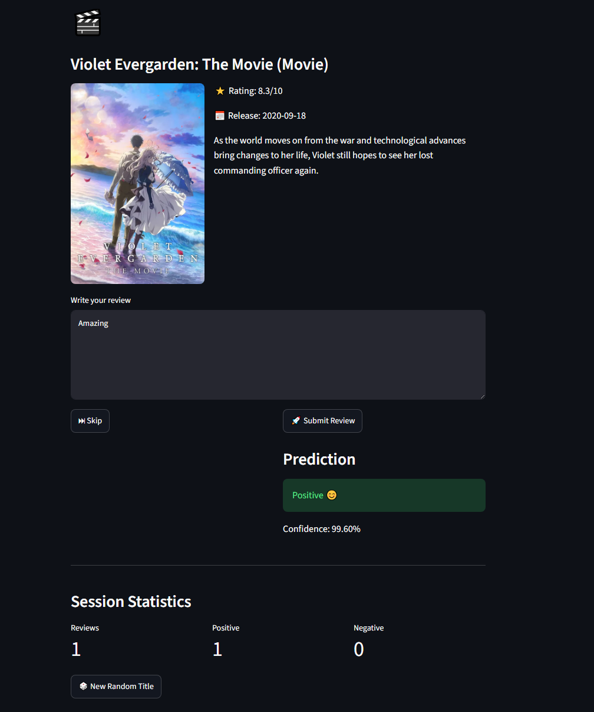

# BERT Sentiment Analysis

**Real-time sentiment analysis on top-rated movies & TV series — powered by a fine-tuned BERT model.**

---

<!-- Screenshot: drop assets/screenshot.png then uncomment the line below -->

---

## What It Does

BERTSentiment fetches a random title from the **top 100 movies and top 100 TV series** on TMDB, displays its poster and overview, and asks you to write a review. The moment you submit, a fine-tuned BERT model reads your text and predicts whether the sentiment is **Positive** or **Negative** — with a confidence score. Session statistics track how your reviews accumulate over time.

---

## Architecture

<!-- Architecture diagram: drop assets/architecture.png then uncomment the block below -->

 

| Layer | Detail |
|---|---|
| **Base model** | `bert-base-uncased` (12 transformer layers, 110M parameters) |
| **Classification head** | Linear layer → 2 logits (Negative / Positive) |
| **Tokenizer** | `BertTokenizerFast` — WordPiece, max 512 tokens |
| **Inference** | `torch.no_grad()` + softmax over logits |
| **Frontend** | Streamlit on HuggingFace Spaces — cached model load via `@st.cache_resource` |
| **Content API** | TMDB `/movie/top_rated` + `/tv/top_rated`, pages 1–5, cached 1 h |

The app loads the model once at startup and reuses it for every review. TMDB's top-rated lists are fetched once per hour so the pool of titles stays fresh without hammering the API.

---

## Dataset & Training

Training used the **Stanford IMDb Large Movie Review Dataset** — the standard benchmark for binary sentiment classification.

| Property | Value |
|---|---|
| Dataset | [Stanford IMDb](https://ai.stanford.edu/~amaas/data/sentiment/) via HuggingFace `datasets` |
| Train split | 25,000 reviews |
| Test split | 25,000 reviews |
| Label balance | 50 % positive / 50 % negative |
| Max sequence length | 512 tokens |

### Training configuration

| Hyperparameter | Value |
|---|---|
| Base checkpoint | `bert-base-uncased` |
| Epochs | 3 |
| Learning rate | 2e-5 |
| Batch size | 8 (train & eval) |
| Weight decay | 0.01 |
| Scheduler | Linear warmup |
| Best model strategy | Loaded at end of best eval epoch |

### Results

**Evaluation per epoch**

| Epoch | Eval Accuracy | Eval Loss |
|---|---|---|
| 1 | 92.08 % | 0.2707 |
| **2** | **93.80 %** | **0.2687** ← best checkpoint |

> Training ran for 3 epochs, but `load_best_model_at_end=True` restored the epoch-2 checkpoint as the final model — the point where eval loss was lowest.

**Training loss progression**

| Step | Epoch | Train Loss |
|---|---|---|
| 500 | 0.16 | 0.3897 |
| 1000 | 0.32 | 0.3037 |
| 2000 | 0.64 | 0.2889 |
| 3000 | 0.96 | 0.2602 |
| 3500 | 1.12 | 0.1898 |
| 4500 | 1.44 | 0.1604 |
| 5000 | 1.60 | 0.1494 |
| 6000 | 1.92 | 0.1431 |

Loss dropped sharply from ~0.39 in the first steps to ~0.14 by the end of epoch 2, reflecting rapid task adaptation on top of the pre-trained representations.

**Summary**

| Metric | Value |
|---|---|
| **Test Accuracy** | **93.81 %** |
| Best eval loss | 0.2687 (epoch 2) |
| Final training loss (3 epochs) | 0.1736 |
| Total training steps | 9,375 |

---

## Live Demo

> **[https://US10F-bert-sentiment.hf.space](https://US10F-bert-sentiment.hf.space)**

---

## App Features

- **Top-rated pool** — draws randomly from the top 100 movies and top 100 TV series (TMDB), so you always get titles worth talking about
- **Live sentiment prediction** — BERT inference runs in under a second on CPU
- **Confidence score** — softmax probability displayed alongside the label
- **Session statistics** — running totals of positive vs. negative reviews
- **Skip & refresh** — skip any title or request a new random one at any time

---

